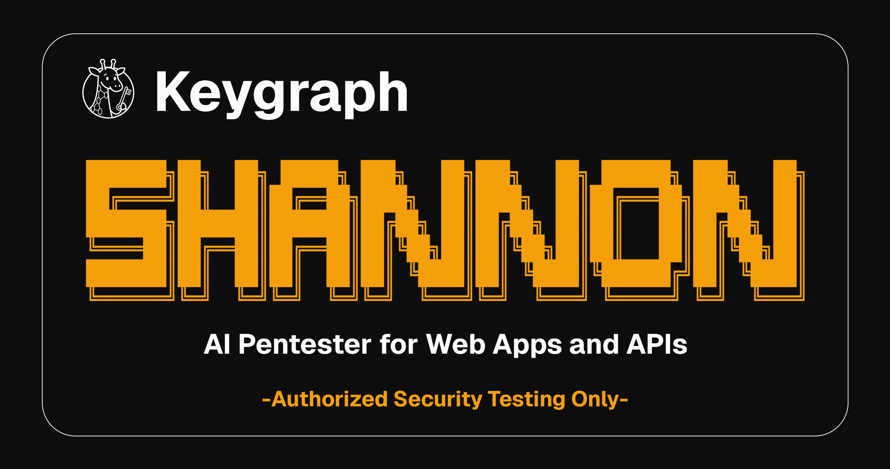

<div align="center">



# List Security AI — AI Pentester by List

<a href="https://trendshift.io/repositories/15604" target="_blank"></a>

List Security AI is an autonomous, white-box AI pentester for web applications and APIs. <br />
It analyzes your source code, identifies attack vectors, and executes real exploits to prove vulnerabilities before they reach production.

---


<a href="https://discord.gg/9ZqQPuhJB7"></a>
<a href="https://keygraph.io/"></a>
<a href="https://www.linkedin.com/company/keygraph/"></a>

---
</div>

## 🎯 What is List Security AI?

List Security AI is an AI pentester developed by [Keygraph](https://keygraph.io). It performs white-box security testing of web applications and their underlying APIs by combining source code analysis with live exploitation.

List Security AI analyzes your web application's source code to identify potential attack vectors, then uses browser automation and command-line tools to execute real exploits (injection attacks, authentication bypass, SSRF, XSS) against the running application and its APIs. Only vulnerabilities with a working proof-of-concept are included in the final report.

**Why List Security AI Exists**

Thanks to tools like Claude Code and Cursor, your team ships code non-stop. But your penetration test? That happens once a year. This creates a *massive* security gap. For the other 364 days, you could be unknowingly shipping vulnerabilities to production.

List Security AI closes that gap by providing on-demand, automated penetration testing that can run against every build or release.

> [!NOTE]
> **List Security AI is part of the Keygraph Security and Compliance Platform**
>
> Keygraph is an integrated security and compliance platform covering IAM, MDM, compliance automation (SOC 2, HIPAA), and application security. List Security AI handles the AppSec layer. The broader platform automates evidence collection, audit readiness, and continuous compliance across multiple frameworks.
>
> **[Learn more at keygraph.io](https://keygraph.io)**

## 🎬 List Security AI in Action

List Security AI identified 20+ vulnerabilities in OWASP Juice Shop, including authentication bypass and database exfiltration. [Full report →](sample-reports/shannon-report-juice-shop.md)


## ✨ Features

- **Fully Autonomous Operation**: A single command launches the full pentest. List Security AI handles 2FA/TOTP logins (including SSO), browser navigation, exploitation, and report generation without manual intervention.
- **Reproducible Proof-of-Concept Exploits**: The final report contains only proven, exploitable findings with copy-and-paste PoCs. Vulnerabilities that cannot be exploited are not reported.
- **OWASP Vulnerability Coverage**: Identifies and validates Injection, XSS, SSRF, and Broken Authentication/Authorization, with additional categories in development.
- **Code-Aware Dynamic Testing**: Analyzes source code to guide attack strategy, then validates findings with live browser and CLI-based exploits against the running application.
- **Integrated Security Tooling**: Leverages Nmap, Subfinder, WhatWeb, and Schemathesis during reconnaissance and discovery phases.
- **Parallel Processing**: Vulnerability analysis and exploitation phases run concurrently across all attack categories.

## 📦 Product Line

List Security AI is developed by [Keygraph](https://keygraph.io) and available in two editions:

| Edition | License | Best For |
|---------|---------|----------|
| **List Security AI Lite** | AGPL-3.0 | Local testing of your own applications. |
| **List Security AI Pro** | Commercial | Organizations needing a single AppSec platform (SAST, SCA, secrets, business logic testing, autonomous pentesting) with CI/CD integration and self-hosted deployment. |

> **This repository contains List Security AI Lite,** the core autonomous AI pentesting framework. **List Security AI Pro** is Keygraph's all-in-one AppSec platform, combining SAST, SCA, secrets scanning, business logic security testing, and autonomous AI pentesting in a single correlated workflow. Every finding is validated with a working proof-of-concept exploit.

> [!IMPORTANT]
> **White-box only.** List Security AI Lite is designed for **white-box (source-available)** application security testing.  
> It expects access to your application's source code and repository layout.

### List Security AI Pro: Architecture Overview

List Security AI Pro is an all-in-one application security platform that replaces the need to stitch together separate SAST, SCA, secrets scanning, and pentesting tools. It operates as a two-stage pipeline: agentic static analysis of the codebase, followed by autonomous AI penetration testing. Findings from both stages are cross-referenced and correlated, so every reported vulnerability has a working proof-of-concept exploit and a precise source code location.

**Stage 1: Agentic Static Analysis**

List Security AI Pro transforms the codebase into a Code Property Graph (CPG) combining the AST, control flow graph, and program dependence graph. It then runs five analysis capabilities:

- **Data Flow Analysis (SAST)**: Identifies sources (user input, API requests) and sinks (SQL queries, command execution), then traces paths between them. At each node, an LLM evaluates whether the specific sanitization applied is sufficient for the specific vulnerability in context, rather than relying on a hard-coded allowlist of safe functions.
- **Point Issue Detection (SAST)**: LLM-based detection of single-location vulnerabilities: weak cryptography, hardcoded credentials, insecure configuration, missing security headers, weak RNG, disabled certificate validation, and overly permissive CORS.
- **Business Logic Security Testing (SAST)**: LLM agents analyze the codebase to discover application-specific invariants (e.g., "document access must verify organizational ownership"), generate targeted fuzzers to violate those invariants, and synthesize full PoC exploits. This catches authorization failures and domain-specific logic errors that pattern-based scanners cannot detect.
- **SCA with Reachability Analysis**: Goes beyond flagging CVEs by tracing whether the vulnerable function is actually reachable from application entry points via the CPG. Unreachable vulnerabilities are deprioritized.
- **Secrets Detection**: Combines regex pattern matching with LLM-based detection (for dynamically constructed credentials, custom formats, obfuscated tokens) and performs liveness validation against the corresponding service using read-only API calls.

**Stage 2: Autonomous Dynamic Penetration Testing**

The same multi-agent pentest pipeline as List Security AI Lite (reconnaissance, parallel vulnerability analysis, parallel exploitation, reporting), enhanced with static findings injected into the exploitation queue. Static findings are mapped to List Security AI's five attack domains (Injection, XSS, SSRF, Auth, Authz), and exploit agents attempt real proof-of-concept attacks against the running application for each finding.

**Static-Dynamic Correlation**

This is the core differentiator. A data flow vulnerability identified in static analysis (e.g., unsanitized input reaching a SQL query) is not reported as a theoretical risk. It is fed to the corresponding exploit agent, which attempts to exploit it against the live application. Confirmed exploits are traced back to the exact source code location, giving developers both proof of exploitability and the line of code to fix.

**Deployment Model**

List Security AI Pro supports a self-hosted runner model (similar to GitHub Actions self-hosted runners). The data plane, which handles code access and all LLM API calls, runs entirely within the customer's infrastructure using the customer's own API keys. Source code never leaves the customer's network. The Keygraph control plane handles job orchestration, scan scheduling, and the reporting UI, receiving only aggregate findings.

| Capability | List Security AI Lite | List Security AI Pro (All-in-One AppSec) |
| --- | --- | --- |
| **Licensing** | AGPL-3.0 | Commercial |
| **Static Analysis** | Code review prompting | Full agentic SAST, SCA, secrets, business logic testing |
| **Dynamic Testing** | Autonomous AI pentesting | Autonomous AI pentesting with static-dynamic correlation |
| **Analysis Engine** | Code review prompting | CPG-based data flow with LLM reasoning at every node |
| **Business Logic** | None | Automated invariant discovery, fuzzer generation, exploit synthesis |
| **CI/CD Integration** | Manual / CLI | Native CI/CD, GitHub PR scanning |
| **Deployment** | CLI | Managed cloud or self-hosted runner |
| **Boundary Analysis** | None | Automatic service boundary detection with team routing |

[Full technical details →](./LIST-SECURITY-AI-PRO.md)

## 📑 Table of Contents

- [What is List Security AI?](#-what-is-list-security-ai)
- [List Security AI in Action](#-list-security-ai-in-action)
- [Features](#-features)
- [Product Line](#-product-line)
- [Setup & Usage Instructions](#-setup--usage-instructions)
  - [Prerequisites](#prerequisites)
  - [Quick Start](#quick-start)
  - [Monitoring Progress](#monitoring-progress)
  - [Stopping Shannon](#stopping-shannon)  - [Stopping Shannon](#stopping-shannon)
  - [Usage Examples](#usage-examples)
  - [Workspaces and Resuming](#workspaces-and-resuming)
  - [Configuration (Optional)](#configuration-optional)
  - [AWS Bedrock](#aws-bedrock)
  - [Google Vertex AI](#google-vertex-ai)
  - [Custom Base URL](#custom-base-url)
  - [[EXPERIMENTAL - UNSUPPORTED] Router Mode (Alternative Providers)](#experimental---unsupported-router-mode-alternative-providers)
  - [Output and Results](#output-and-results)
- [Sample Reports](#-sample-reports)
- [Benchmark](#-benchmark)
- [Architecture](#️-architecture)
- [Coverage and Roadmap](#-coverage-and-roadmap)
- [Disclaimers](#️-disclaimers)
- [License](#-license)
- [Community & Support](#-community--support)
- [Get in Touch](#-get-in-touch)

---

## 🚀 Setup & Usage Instructions

### Prerequisites

- **Docker** - Container runtime ([Install Docker](https://docs.docker.com/get-docker/))
### AI Provider Credentials

- **OpenRouter API key** (recommended) - Get from [OpenRouter Console](https://openrouter.ai/keys)

#### Model Selection

You can choose between different models using the `AI` parameter:

| Value | Model Name | Description |
|-------|------------|-------------|
| `1` | `openrouter/healer-alpha` | Default specialized security model |
| `2` | `nvidia/nemotron-3-super` | High-performance general model |
| `3` | `openrouter/hunter-alpha` | Advanced security analysis model |

Example usage:
```bash
./list-security-ai start URL=https://example.com REPO=repo-name AI=2
```

### Quick Start

```bash
# 1. Clone Shannon
git clone https://github.com/your-org/your-repo.git ./repos/your-repo

# 2. Configure credentials (choose one method)

# Option A: Export environment variables
export ANTHROPIC_API_KEY="your-api-key"              # or CLAUDE_CODE_OAUTH_TOKEN
export CLAUDE_CODE_MAX_OUTPUT_TOKENS=64000           # recommended

# Option B: Create a .env file
cat > .env << 'EOF'
ANTHROPIC_API_KEY=your-api-key
CLAUDE_CODE_MAX_OUTPUT_TOKENS=64000
EOF

# 3. Run a pentest
./shannon start URL=https://your-app.com REPO=your-repo
```

List Security AI will build the containers, start the workflow, and return a workflow ID. The pentest runs in the background.

### Monitoring Progress

```bash
# View real-time worker logs
./shannon logs

# Query a specific workflow's progress
./shannon query ID=shannon-1234567890

# Open the Temporal Web UI for detailed monitoring
open http://localhost:8233
```

### Stopping Shannon

```bash
# Stop all containers (preserves workflow data)
./list-security-ai stop

# Full cleanup (removes all data)
./list-security-ai stop CLEAN=true
```

### Usage Examples

```bash
# Basic pentest
./shannon start URL=https://example.com REPO=repo-name

# With a configuration file
./shannon start URL=https://example.com REPO=repo-name CONFIG=./configs/my-config.yaml

# Custom output directory
./shannon start URL=https://example.com REPO=repo-name OUTPUT=./my-reports

# Named workspace
./list-security-ai start URL=https://example.com REPO=repo-name WORKSPACE=q1-audit

# List all workspaces
./list-security-ai workspaces
```

### Workspaces and Resuming

List Security AI supports **workspaces** that allow you to resume interrupted or failed runs without re-running completed agents.

**How it works:**
- Every run creates a workspace in `audit-logs/` (auto-named by default, e.g. `example-com_shannon-1771007534808`)
- Use `WORKSPACE=<name>` to give your run a custom name for easier reference
- To resume any run, pass its workspace name via `WORKSPACE=` — List Security AI detects which agents completed successfully and picks up where it left off
- Each agent's progress is checkpointed via git commits, so resumed runs start from a clean, validated state

```bash
# Start with a named workspace
./list-security-ai start URL=https://example.com REPO=repo-name WORKSPACE=my-audit

# Resume the same workspace (skips completed agents)
./shannon start URL=https://example.com REPO=repo-name WORKSPACE=my-audit

# Resume an auto-named workspace from a previous run
./list-security-ai start URL=https://example.com REPO=repo-name WORKSPACE=example-com_shannon-1771007534808

# List all workspaces and their status
./shannon workspaces
```

> [!NOTE]
> The `URL` must match the original workspace URL when resuming. List Security AI will reject mismatched URLs to prevent cross-target contamination.

### Prepare Your Repository

List Security AI expects target repositories to be placed under the `./repos/` directory at the project root. The `REPO` flag refers to a folder name inside `./repos/`. Copy the repository you want to scan into `./repos/`, or clone it directly there:

```bash
git clone https://github.com/your-org/your-repo.git ./repos/your-repo
```

**For monorepos:**

```bash
git clone https://github.com/your-org/your-monorepo.git ./repos/your-monorepo
```

**For multi-repository applications** (e.g., separate frontend/backend):

```bash
mkdir ./repos/your-app
cd ./repos/your-app
git clone https://github.com/your-org/frontend.git
git clone https://github.com/your-org/backend.git
git clone https://github.com/your-org/api.git
```

### Platform-Specific Instructions

**For Windows:**

*Native (Git Bash):*

Install [Git for Windows](https://git-scm.com/install/windows) and run List Security AI from **Git Bash** with Docker Desktop installed.

*WSL2 (Recommended):*

**Step 1: Ensure WSL 2**

```powershell
wsl --install
wsl --set-default-version 2

# Check installed distros
wsl --list --verbose

# If you don't have a distro, install one (Ubuntu 24.04 recommended)
wsl --list --online
wsl --install Ubuntu-24.04

# If your distro shows VERSION 1, convert it to WSL 2:
wsl --set-version <distro-name> 2
```

See [WSL basic commands](https://learn.microsoft.com/en-us/windows/wsl/basic-commands) for reference.

**Step 2: Install Docker Desktop on Windows** and enable **WSL2 backend** under *Settings > General > Use the WSL 2 based engine*.

**Step 3: Clone and run List Security AI inside WSL.** Type `wsl -d <distro-name>` in PowerShell or CMD and press Enter to open a WSL terminal.

```bash
# Inside WSL terminal
git clone https://github.com/your-org/your-repo.git ./repos/your-repo
cp .env.example .env  # Edit with your API key
./shannon start URL=https://your-app.com REPO=your-repo
```

To access the Temporal Web UI, run `ip addr` inside WSL to find your WSL IP address, then navigate to `http://<wsl-ip>:8233` in your Windows browser.

Windows Defender may flag exploit code in reports as false positives; see [Antivirus False Positives](#6-windows-antivirus-false-positives) below.

**For Linux (Native Docker):**

You may need to run commands with `sudo` depending on your Docker setup. If you encounter permission issues with output files, ensure your user has access to the Docker socket.

**For macOS:**

Works out of the box with Docker Desktop installed.

**Testing Local Applications:**

Docker containers cannot reach `localhost` on your host machine. Use `host.docker.internal` in place of `localhost`:

```bash
./list-security-ai start URL=http://host.docker.internal:3000 REPO=repo-name
```

### Configuration (Optional)

While you can run without a config file, creating one enables authenticated testing and customized analysis. Place your configuration files inside the `./configs/` directory — this folder is mounted into the Docker container automatically.

#### Create Configuration File

Copy and modify the example configuration:

```bash
cp configs/example-config.yaml configs/my-app-config.yaml
```

#### Basic Configuration Structure

```yaml
authentication:
  login_type: form
  login_url: "https://your-app.com/login"
  credentials:
    username: "test@example.com"
    password: "yourpassword"
    totp_secret: "LB2E2RX7XFHSTGCK"  # Optional for 2FA

  login_flow:
    - "Type $username into the email field"
    - "Type $password into the password field"
    - "Click the 'Sign In' button"

  success_condition:
    type: url_contains
    value: "/dashboard"

rules:
  avoid:
    - description: "AI should avoid testing logout functionality"
      type: path
      url_path: "/logout"

  focus:
    - description: "AI should emphasize testing API endpoints"
      type: path
      url_path: "/api"
```

#### TOTP Setup for 2FA

If your application uses two-factor authentication, simply add the TOTP secret to your config file. The AI will automatically generate the required codes during testing.

#### Subscription Plan Rate Limits

If your application uses two-factor authentication, simply add the TOTP secret to your config file. The AI will automatically generate the required codes during testing.

#### Subscription Plan Rate Limits

Anthropic subscription plans reset usage on a **rolling 5-hour window**. The default retry strategy (30-min max backoff) will exhaust retries before the window resets. Add this to your config:

```yaml
pipeline:
  retry_preset: subscription          # Extends max backoff to 6h, 100 retries
  max_concurrent_pipelines: 2         # Run 2 of 5 pipelines at a time (reduces burst API usage)
```

`max_concurrent_pipelines` controls how many vulnerability pipelines run simultaneously (1-5, default: 5). Lower values reduce the chance of hitting rate limits but increase wall-clock time.


### Output and Results

All results are saved to `./audit-logs/{hostname}_{sessionId}/` by default. Use `--output <path>` to specify a custom directory.

Output structure:
```
audit-logs/{hostname}_{sessionId}/
├── session.json          # Metrics and session data
├── agents/               # Per-agent execution logs
├── prompts/              # Prompt snapshots for reproducibility
└── deliverables/
    └── comprehensive_security_assessment_report.md   # Final comprehensive security report
```

---

## 📊 Sample Reports

Sample penetration test reports from industry-standard vulnerable applications:

#### 🧃 **OWASP Juice Shop** • [GitHub](https://github.com/juice-shop/juice-shop)

*A notoriously insecure web application maintained by OWASP, designed to test a tool's ability to uncover a wide range of modern vulnerabilities.*

**Results**: Identified over 20 vulnerabilities across targeted OWASP categories in a single automated run.

**Notable findings**:

- Authentication bypass and full user database exfiltration via SQL injection
- Privilege escalation to administrator through registration workflow bypass
- IDOR vulnerabilities enabling access to other users' data and shopping carts
- SSRF enabling internal network reconnaissance

📄 **[View Complete Report →](sample-reports/shannon-report-juice-shop.md)**

---

#### 🔗 **c{api}tal API** • [GitHub](https://github.com/Checkmarx/capital)

*An intentionally vulnerable API from Checkmarx, designed to test a tool's ability to uncover the OWASP API Security Top 10.*

**Results**: Identified approximately 15 critical and high-severity vulnerabilities.

**Notable findings**:

- Root-level command injection via denylist bypass in a hidden debug endpoint
- Authentication bypass through a legacy, unpatched v1 API endpoint
- Privilege escalation via Mass Assignment in the user profile update function
- Zero false positives for XSS (correctly confirmed robust XSS defenses)

📄 **[View Complete Report →](sample-reports/shannon-report-capital-api.md)**

---

#### 🚗 **OWASP crAPI** • [GitHub](https://github.com/OWASP/crAPI)

*A modern, intentionally vulnerable API from OWASP, designed to benchmark a tool's effectiveness against the OWASP API Security Top 10.*

**Results**: Identified over 15 critical and high-severity vulnerabilities.

**Notable findings**:

- Authentication bypass via multiple JWT attacks (Algorithm Confusion, alg:none, weak key injection)
- Full PostgreSQL database compromise via injection, exfiltrating user credentials
- SSRF attack forwarding internal authentication tokens to an external service
- Zero false positives for XSS (correctly identified robust XSS defenses)

📄 **[View Complete Report →](sample-reports/shannon-report-crapi.md)**

---

## 📈 Benchmark

List Security AI Lite scored **96.15% (100/104 exploits)** on a hint-free, source-aware variant of the XBOW security benchmark.

**[Full results with detailed agent logs and per-challenge pentest reports →](./xben-benchmark-results/README.md)**

---

## 🏗️ Architecture

List Security AI uses a multi-agent architecture that combines white-box source code analysis with dynamic exploitation across four phases:

```
                    ┌──────────────────────┐
                    │    Reconnaissance    │
                    └──────────┬───────────┘
                               │
                               ▼
                    ┌──────────┴───────────┐
                    │          │           │
                    ▼          ▼           ▼
        ┌─────────────────┐ ┌─────────────────┐ ┌─────────────────┐
        │ Vuln Analysis   │ │ Vuln Analysis   │ │      ...        │
        │  (Injection)    │ │     (XSS)       │ │                 │
        └─────────┬───────┘ └─────────┬───────┘ └─────────┬───────┘
                  │                   │                   │
                  ▼                   ▼                   ▼
        ┌─────────────────┐ ┌─────────────────┐ ┌─────────────────┐
        │  Exploitation   │ │  Exploitation   │ │      ...        │
        │  (Injection)    │ │     (XSS)       │ │                 │
        └─────────┬───────┘ └─────────┬───────┘ └─────────┬───────┘
                  │                   │                   │
                  └─────────┬─────────┴───────────────────┘
                            │
                            ▼
                    ┌──────────────────────┐
                    │      Reporting       │
                    └──────────────────────┘
```

### Architectural Overview

List Security AI uses Anthropic's Claude Agent SDK as its reasoning engine within a multi-agent architecture. The system combines white-box source code analysis with black-box dynamic exploitation, managed by an orchestrator across four phases. The architecture is designed for minimal false positives through a "no exploit, no report" policy.

---

#### **Phase 1: Reconnaissance**

The first phase builds a comprehensive map of the application's attack surface. List Security AI analyzes the source code and integrates with tools like Nmap and Subfinder to understand the tech stack and infrastructure. Simultaneously, it performs live application exploration via browser automation to correlate code-level insights with real-world behavior, producing a detailed map of all entry points, API endpoints, and authentication mechanisms for the next phase.

#### **Phase 2: Vulnerability Analysis**

To maximize efficiency, this phase operates in parallel. Using the reconnaissance data, specialized agents for each OWASP category hunt for potential flaws in parallel. For vulnerabilities like Injection and SSRF, agents perform a structured data flow analysis, tracing user input to dangerous sinks. This phase produces a key deliverable: a list of **hypothesized exploitable paths** that are passed on for validation.

#### **Phase 3: Exploitation**

Continuing the parallel workflow to maintain speed, this phase is dedicated entirely to turning hypotheses into proof. Dedicated exploit agents receive the hypothesized paths and attempt to execute real-world attacks using browser automation, command-line tools, and custom scripts. This phase enforces a strict **"No Exploit, No Report"** policy: if a hypothesis cannot be successfully exploited to demonstrate impact, it is discarded as a false positive.

#### **Phase 4: Reporting**

The final phase compiles all validated findings into a professional, actionable report. An agent consolidates the reconnaissance data and the successful exploit evidence, cleaning up any noise or hallucinated artifacts. Only verified vulnerabilities are included, complete with **reproducible, copy-and-paste Proof-of-Concepts**, delivering a final pentest-grade report focused exclusively on proven risks.


## 📋 Coverage and Roadmap

For detailed information about List Security AI's security testing coverage and development roadmap, see our [Coverage and Roadmap](./COVERAGE.md) documentation.

## ⚠️ Disclaimers

### Important Usage Guidelines & Disclaimers

Please review the following guidelines carefully before using List Security AI (Lite). As a user, you are responsible for your actions and assume all liability.

#### **1. Potential for Mutative Effects & Environment Selection**

This is not a passive scanner. The exploitation agents are designed to **actively execute attacks** to confirm vulnerabilities. This process can have mutative effects on the target application and its data.

> [!WARNING]
> **⚠️ DO NOT run List Security AI on production environments.**
>
> - It is intended exclusively for use on sandboxed, staging, or local development environments where data integrity is not a concern.
> - Potential mutative effects include, but are not limited to: creating new users, modifying or deleting data, compromising test accounts, and triggering unintended side effects from injection attacks.

#### **2. Legal & Ethical Use**

List Security AI is designed for legitimate security auditing purposes only.

> [!CAUTION]
> **You must have explicit, written authorization** from the owner of the target system before running List Security AI.
>
> Unauthorized scanning and exploitation of systems you do not own is illegal and can be prosecuted under laws such as the Computer Fraud and Abuse Act (CFAA). Keygraph is not responsible for any misuse of List Security AI.

#### **3. LLM & Automation Caveats**

- **Verification is Required**: While significant engineering has gone into our "proof-by-exploitation" methodology to eliminate false positives, the underlying LLMs can still generate hallucinated or weakly-supported content in the final report. **Human oversight is essential** to validate the legitimacy and severity of all reported findings.
- **Comprehensiveness**: The analysis in List Security AI Lite may not be exhaustive due to the inherent limitations of LLM context windows. For a more comprehensive, graph-based analysis of your entire codebase, **List Security AI Pro** leverages its advanced data flow analysis engine to ensure deeper and more thorough coverage.

#### **4. Scope of Analysis**

- **Targeted Vulnerabilities**: The current version of List Security AI Lite specifically targets the following classes of *exploitable* vulnerabilities:
  - Broken Authentication & Authorization
  - Injection
  - Cross-Site Scripting (XSS)
  - Server-Side Request Forgery (SSRF)
- **What Shannon Lite Does Not Cover**: This list is not exhaustive of all potential security risks. Shannon Lite's "proof-by-exploitation" model means it will not report on issues it cannot actively exploit, such as vulnerable third-party libraries or insecure configurations. These types of deep static-analysis findings are a core focus of the advanced analysis engine in **Shannon Pro**.

#### **5. Cost & Performance**

- **Time**: As of the current version, a full test run typically takes **1 to 1.5 hours** to complete.
- **Cost**: Running the full test using Anthropic's Claude 4.5 Sonnet model may incur costs of approximately **$50 USD**. Costs vary based on model pricing and application complexity.

#### **6. Windows Antivirus False Positives**

usion for the List Security AI directory in Wind Listowecurity AInder, or use Docker/WSL2.

#### **7. Security Considerations**

Shannon Lite is designed for scanning repositories and applications you own or have explicit permission to test. Do not point it at untrusted or adversarial codebases. Like any AI-powered tool that reads source code, Shannon Lite is susceptible to prompt injection from content in the scanned repository.


## 📜 License

List Security AI Lite is released under the [GNU Affero General Public License v3.0 (AGPL-3.0)](LICENSE).

ohannonsource (AGPL v3). This license allows you to:
- Use it freely for all internal security testing.
- Modify the code privately for internal use without sharing your changes.

The AGPL's sharing requirements primarily apply to organizations offering List Security AI as a public or managed service (such as a SaaS platform). In those specific cases, any modifications made to the core software must be open-sourced.


## 👥 Community & Support

### Community Resources

📅 **1:1 Office Hours** — Thursdays, two time zones
Book a free 15-min session for hands-on help with bugs, deployments, or config questions.
→ US/EU: 10:00 AM PT  |  Asia: 2:00 PM IST
→ [Book a slot](https://cal.com/george-flores-keygraph/shannon-community-office-hours)

💬 [Join our Discord](https://discord.gg/cmctpMBXwE) to ask questions, share feedback, and connect with other List Security AI users.

**Contributing:** At this time, we're not accepting external code contributions (PRs).  
Issues are welcome for bug reports and feature requests.

- 🐛 **Report bugs** via [GitHub Issues](https://github.com/KeygraphHQ/shannon/issues)
- 💡 **Suggest features** in [Discussions](https://github.com/KeygraphHQ/shannon/discussions)

### Stay Connected

- 🐦 **Twitter**: [@KeygraphHQ](https://twitter.com/KeygraphHQ)
- 💼 **LinkedIn**: [Keygraph](https://linkedin.com/company/keygraph)
- 🌐 **Website**: [keygraph.io](https://keygraph.io)


## 💬 Get in Touch

### List Security AI Pro

List Security AI Pro is Keygraph's all-in-one AppSec platform. For organizations that need unified SAST, SCA, secrets scanning, business logic testing, and autonomous pentesting with static-dynamic correlation, CI/CD integration, or self-hosted deployment, see the [List Security AI Pro technical overview](./LIST-SECURITY-AI-PRO.md).

<p align="center">
  <a href="https://docs.google.com/forms/d/e/1FAIpQLSf-cPZcWjlfBJ3TCT8AaWpf8ztsw3FaHzJE4urr55KdlQs6cQ/viewform?usp=header" target="_blank">
    
  </a>
</p>

📧 **Email**: [list-security-ai@keygraph.io](mailto:list-security-ai@keygraph.io)

---

<p align="center">
  <b>Built by <a href="https://keygraph.io">Keygraph</a></b>
</p>
